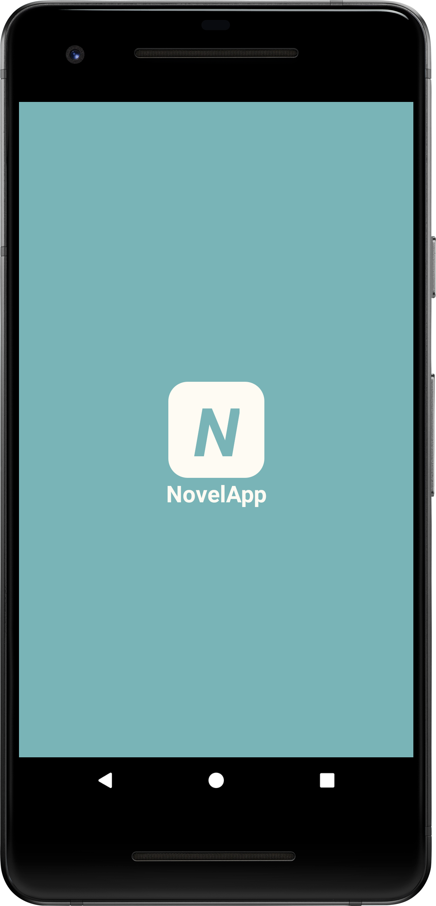
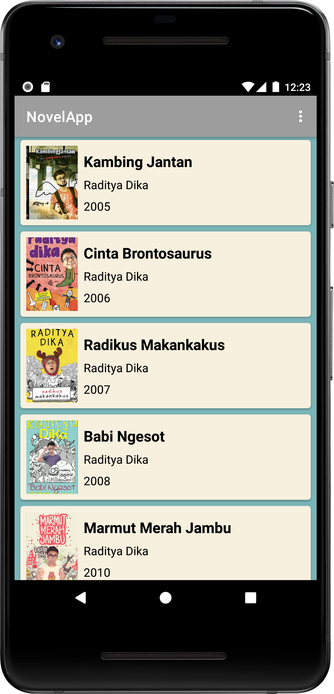
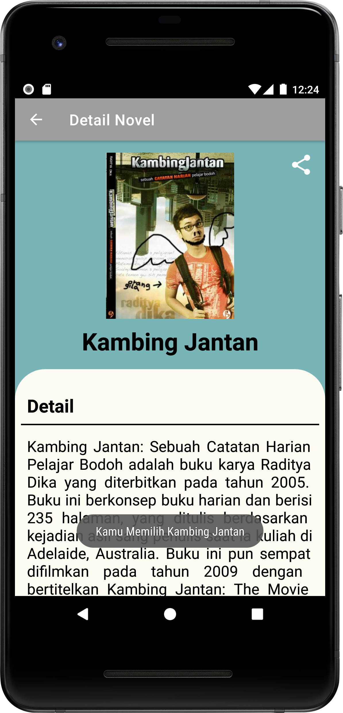
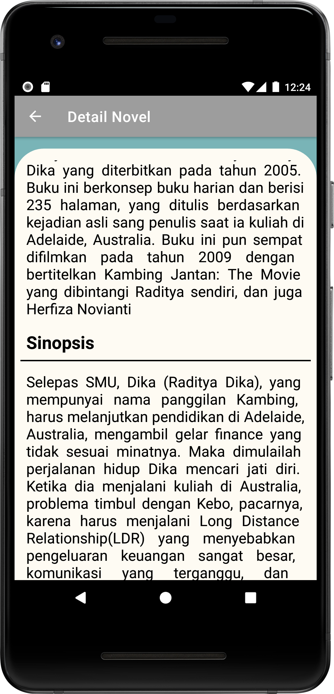
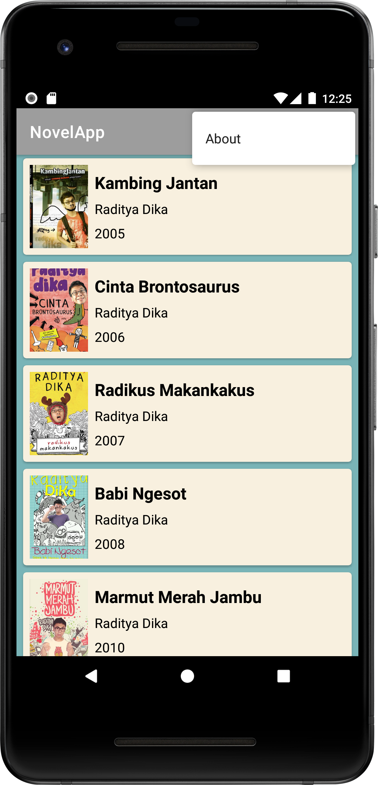
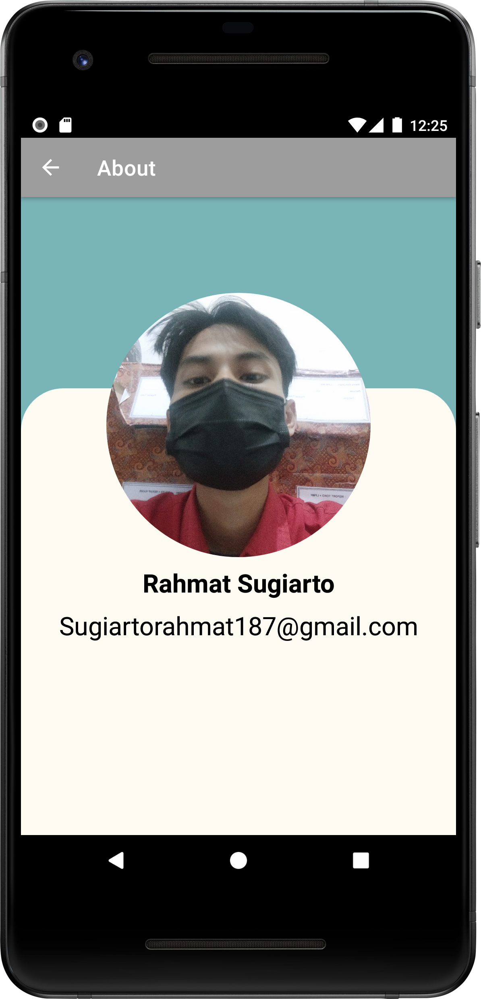
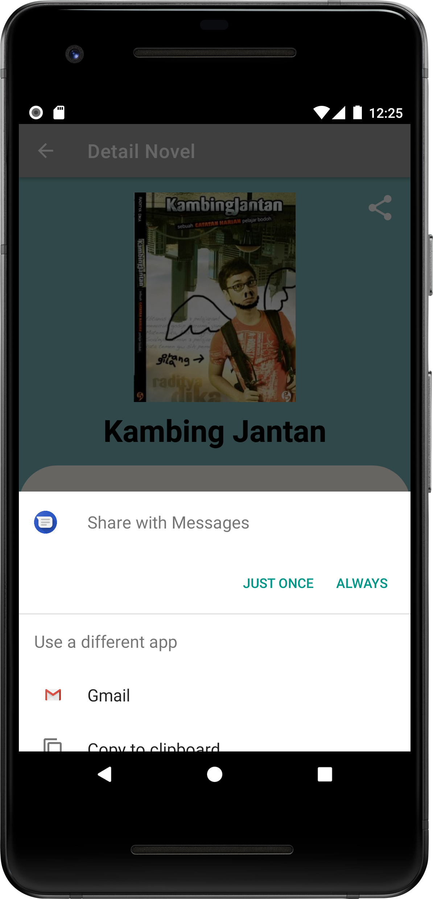

# NovelApp
Dicoding-Belajar Membuat Aplikasi Android untuk Pemula Submission

## IconApp

   

                                                                    
## Components:
- Glide
- Intent(Parcelable and Implisit Intent)
- Collapsing Toolbar layout
- Activity
- RecyclerView
- CardView
- View Binding

## Screenshot

  
  
  
  
  
  
  

